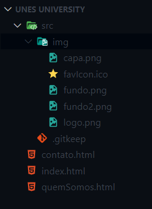
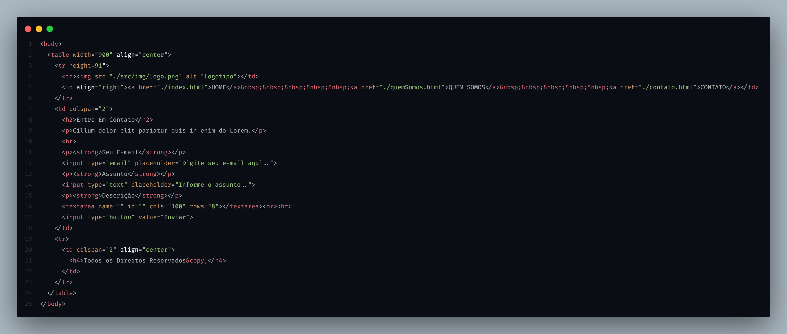
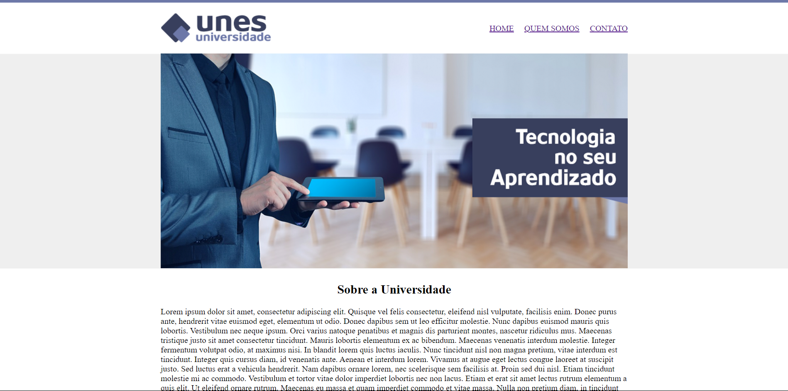

# UNES University

Este é o primeiro projeto do Curso Desenvolvimento Web Completo - 20 cursos + 20 projetos da Udemy. O objetivo deste projeto é criar um site simples usando apenas HTML5. Este README fornecerá uma breve visão geral do projeto e como ele foi desenvolvido.

### Descrição do Projeto
Este código representa o meu primeiro projeto em HTML. O site é uma demonstração simples de como criar uma página da web usando as principais estruturas HTML5. 

O principal destaque deste projeto é o uso da tag &lt;table&gt; para centralizar os itens na página.

### Estrutura de Pastas

### Código contato.html

### Aba "HOME" do Site

### Link do Projeto
<a href="https://unes-university.vercel.app/">Clique Aqui!!</a>
